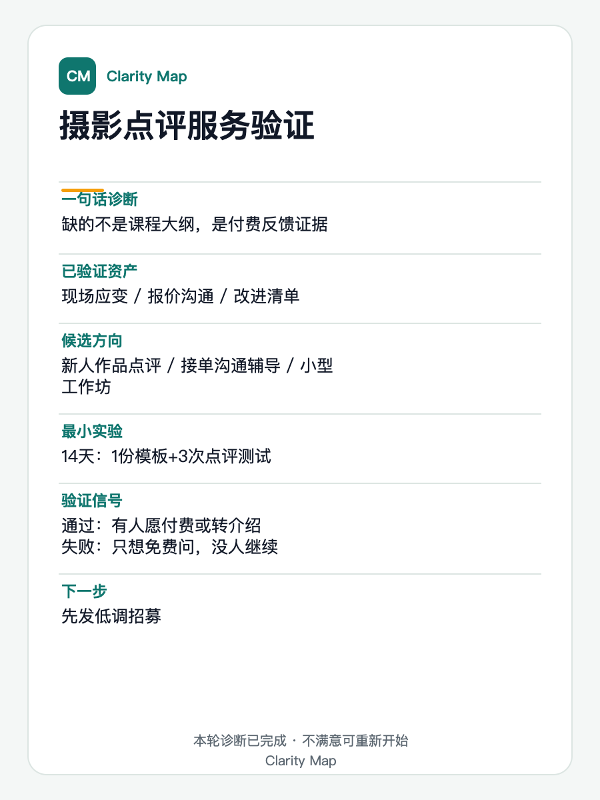

# clarity-map

人生迷茫时刻小地图。一个面向中文用户的 Codex skill，用结构化提问帮用户把「我好像会一些东西，但不知道往哪走」这类混乱，收敛成一张可执行的方向诊断图。

它不是心理咨询、算命、职业规划师，也不是鸡血教练。它的角色更像一个清醒的思考搭子：少问废话，不替人做人生决定，只帮用户看清已有资产、候选方向、能力缺口，以及下一步可以怎么小范围验证。

## 它解决什么问题

`clarity-map` 主要处理四类迷茫：

1. **能力组合混乱**  
   用户会很多东西，也有工作经验，但不知道这些能力能组合成什么方向。

2. **方向混乱**  
   用户不知道下一步该做什么，几个选择都「好像可以，又好像不对」。

3. **能力缺口混乱**  
   用户有目标，但不知道自己到底缺什么能力。

4. **行动混乱**  
   用户有大概方向，但一直开始不了、坚持不了，或者反复重启。

## 核心体验

这个 skill 采用一轮闭环流程：

1. 让用户选择当前迷茫类型。
2. 每轮只问 2-4 个高质量问题。
3. 给出短镜像，帮助用户看见自己真实说了什么。
4. 诊断关键瓶颈，而不是给人格标签。
5. 提炼已验证能力资产。
6. 生成 2-3 个候选方向。
7. 把能力缺口分成「必须学习 / 可以借助 / 暂时不重要」。
8. 给出一个 7 天或 14 天最小实验。
9. 输出结果卡片和固定模板诊断图。
10. 明确结束本轮，不把用户拖进无限追问。

最终用户拿到的不是一篇长文章，而是一个可以先去试的答案。

## 最终输出包含

通常会包含这些部分：

- 当前困惑类型
- 一句话诊断
- 镜像总结
- 关键瓶颈
- 已验证能力资产
- 候选方向
- 能力缺口表
- 一个最小实验
- Clarity Map 结果卡
- 3:4 竖版诊断卡
- 明确完成提示

最终结尾会主动收住：

> 这一轮的梳理到这里就完成了。  
> 接下来先把这个实验走一遍，答案会比继续聊天更准。  
> 如果你看完觉得不对、不像你，可以说「重新开始」。

## 安装

### Codex

把这个仓库克隆到 Codex skills 目录：

```bash
mkdir -p ~/.codex/skills
git clone https://github.com/Lucas-Ren/clarity-map.git ~/.codex/skills/clarity-map
```

然后在 Codex 中使用：

```text
Use $clarity-map
```

或者直接描述你的状态，例如：

```text
我工作几年了，会一些东西，但不知道这些能力能组合成什么方向。
```

### 其他平台

这个仓库的原生格式是 Codex skill。其他平台通常不能直接识别 `SKILL.md` 的技能协议，但可以把它当成提示词/知识库导入：

- **Coze / 扣子 / Bot 平台**：把 `SKILL.md` 放进角色指令，把 `references/` 里的文件作为知识库或附加指令分批导入。
- **普通 ChatGPT / Claude 项目**：把 `SKILL.md` 作为系统/项目指令，把 `references/output_templates.md` 和 `references/diagnosis_framework.md` 作为补充规则。
- **只想复用诊断卡**：直接使用 `scripts/render_diagnosis_card.py` 和 `assets/diagnosis_card_style.json`。

注意：不同平台对系统指令、文件知识库、工具调用的支持不一样。迁移时优先保留状态机、输出契约、非越界规则和闭环结束规则。

## 开始时怎么用

推荐开场：

```text
我现在有点迷茫，帮我用 clarity-map 梳理一下。
```

skill 会让用户先选一个状态：

```text
1. 能力很多，但不知道怎么组合
2. 不知道下一步做什么
3. 有目标，但不知道缺什么能力
4. 大概有方向，但动不起来
```

用户也可以混选：

```text
2 和 4 都有一点。
```

如果用户没有耐心深聊，也可以说：

```text
先给我个初版。
```

## 效果展示

诊断卡示例：



示例对话片段：

```text
用户：选 4。我是自由摄影师，想做个人摄影教学，但一直停在课程大纲和素材准备里，没有真正开始。

Clarity Map：你不是没有方向，你已经有粗方向：从接单摄影师发展个人摄影教学。现在它还停在“准备课程”的状态，没有变成能拿到反馈的小实验。我先问 4 个问题……

用户：最常被问的是接单报价、客户沟通和现场应变。最愿意测试 1 对 1 点评学员作品。最卡的是不知道有没有人愿意付费，也不知道怎么开口招募。

Clarity Map：你现在缺的不是课程大纲，而是一个低风险的付费反馈证据。先做 14 天新人摄影作品点评测试：1 份模板 + 3 次点评测试，验证是否有人愿意付费或转介绍。
```

## 设计原则

- **提问少，但要准**：通常每轮只问 2-4 个问题。
- **先证据，后判断**：优先看真实行为、别人反馈、付费、转介绍、作品、项目结果。
- **不给人生判决**：只给候选方向和实验，不替用户决定人生。
- **不做具体商业/法律/医疗决策**：涉及价格、合同、合规、医疗、职业风险等，只给判断维度，不代替用户下结论。
- **闭环结束**：完整结果交付后，不继续开分支菜单。用户如果觉得不对，可以说「重新开始」。

## 诊断卡

仓库包含一个固定模板诊断卡渲染器：

```bash
python scripts/render_diagnosis_card.py --data card_data.json --out diagnosis-card.svg
```

也可以直接运行仓库里的示例：

```bash
python scripts/render_diagnosis_card.py \
  --data examples/photographer_card_data.json \
  --out examples/photographer_card.svg
```

诊断卡采用固定的 **Canonical Diagnosis Card v1**：

- 3:4 竖版，适合手机分享
- 固定 Clarity Map 视觉识别
- 固定字段 schema
- 只替换数据，不重新设计风格
- 底部包含「本轮诊断已完成 · 不满意可重新开始」

输入数据示例：

```json
{
  "title": "摄影点评服务验证",
  "diagnosis": "缺的不是课程大纲，是付费反馈证据",
  "assets": ["现场应变", "报价沟通", "改进清单"],
  "candidates": ["新人作品点评", "接单沟通辅导", "小型工作坊"],
  "experiment": {
    "timebox": "14天",
    "core_action": "1份模板+3次点评测试"
  },
  "signals": {
    "pass": "有人愿付费或转介绍",
    "fail": "只想免费问，没人继续"
  },
  "cta": "先发低调招募"
}
```

## 文件结构

```text
clarity-map/
├── SKILL.md
├── README.md
├── CHANGELOG.md
├── LICENSE
├── requirements.txt
├── assets/
│   └── diagnosis_card_style.json
├── examples/
│   ├── photographer_card_data.json
│   ├── photographer_card.png
│   ├── photographer_card.svg
│   └── regression_cases.md
├── references/
│   ├── questioning_framework.md
│   ├── diagnosis_framework.md
│   ├── output_templates.md
│   └── visual_templates.md
├── scripts/
│   └── render_diagnosis_card.py
└── tests/
    └── test_render_diagnosis_card.py
```

## 依赖

诊断卡渲染脚本只使用 Python 标准库。仓库提供 `requirements.txt`，当前没有第三方依赖。

运行测试：

```bash
python -m unittest
```

验证 Codex skill 结构：

```bash
python ~/.codex/skills/.system/skill-creator/scripts/quick_validate.py .
```

如果你的系统没有这个校验脚本，也可以先跳过；它只用于检查 `SKILL.md` 的基础结构。

## 维护

仓库里有一组手动回归案例：

```text
examples/regression_cases.md
```

这些案例来自多轮真实测试，用来防止改动时把已经修好的问题改坏。重点检查：

- 是否过度提问
- 阶段诊断和最终结果是否混淆
- 是否给出具体价格数字或法律/医疗/合规判断
- 最终结果是否缺少实验、结果卡、诊断图或完成边界
- 诊断卡是否仍然使用 Canonical Diagnosis Card v1
- 结果是否以「重新开始」作为唯一内置重启入口

重要改动请记录到 `CHANGELOG.md`。

## 边界

这个 skill 不用于：

- 心理危机处理
- 医疗、法律、财务、合规判断
- 替用户做职业/人生最终决定
- 代写完整商业方案、销售话术、合同条款
- 无限陪聊式追问

如果用户表达明显的自伤风险、强烈危机或无法保证安全，skill 会暂停方向诊断流程，建议优先联系现实中的可信任的人、当地紧急资源或专业支持。

## 已知限制

- 这是一个方向澄清工具，不是完整的商业执行系统。
- 诊断卡目前是固定 SVG 模板；如果要适配更多品牌视觉，需要另开模板版本，不建议在单次诊断里自由换风格。
- 其他平台导入方式需要按平台能力微调，仓库只保证 Codex skill 原生格式。
- 回归测试目前以手动案例为主，自动化测试只覆盖诊断卡渲染脚本。

## License

MIT License. See `LICENSE`.

## 状态

当前版本是一个 instruction-first skill，主要通过 `SKILL.md` 和 `references/` 提供流程规则。唯一脚本用于确定性渲染诊断卡，避免每次生成图片时视觉风格漂移。
