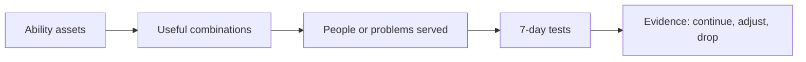
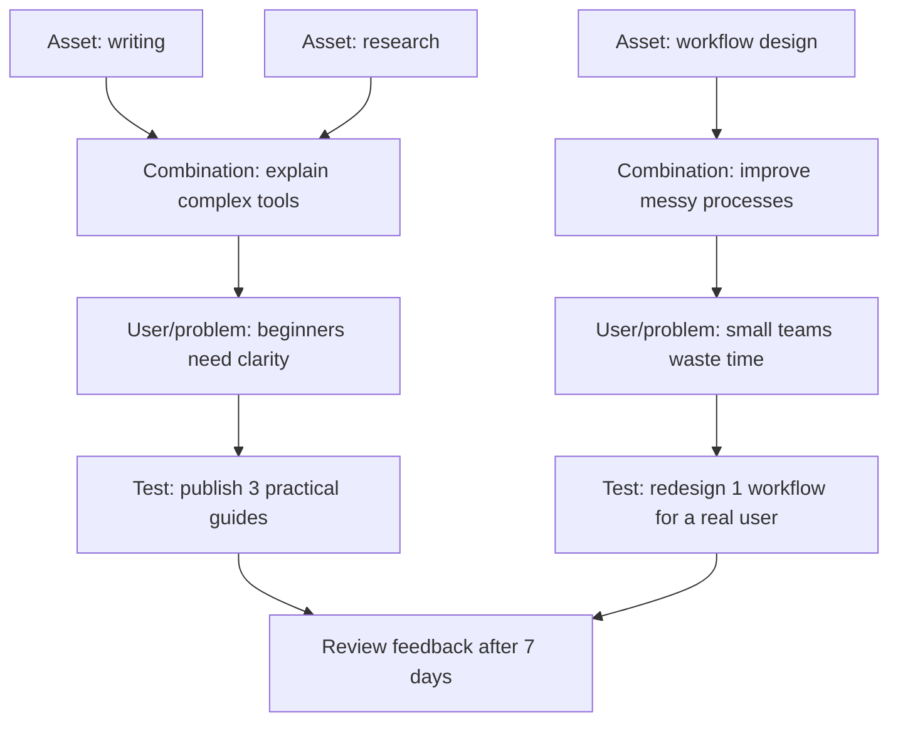
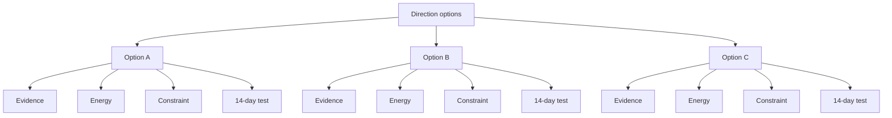
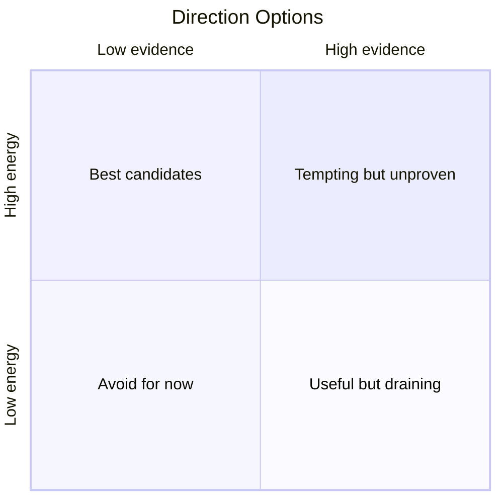
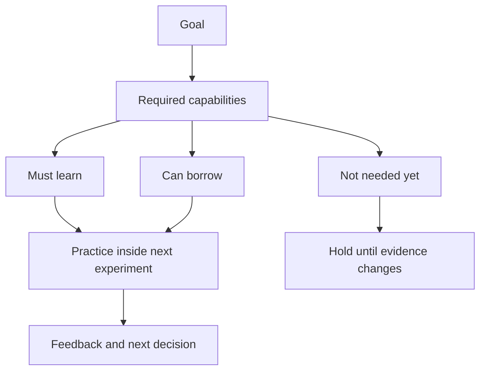
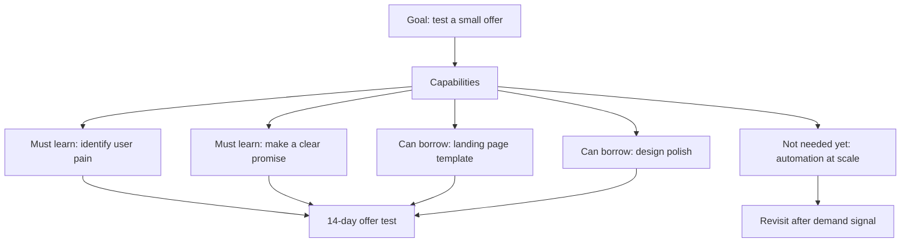
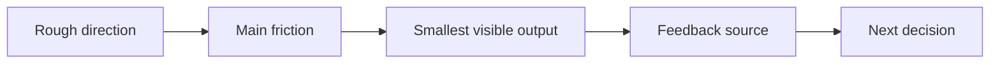

# Visual Templates

Use visuals to reduce cognitive load. Keep them practical: assets, paths, gaps, experiments, feedback. Avoid mystical, heroic, or therapeutic imagery.

## Visual Fallback Order

Use visuals only during final synthesis, result-card, or experiment-summary stages. Do not add visuals during early diagnostic questioning; they interrupt the conversation.

Choose the highest supported layer:

1. Canonical Diagnosis Card v1 renderer:
   - Preferred for final synthesis and close.
   - Use `scripts/render_diagnosis_card.py` with `assets/diagnosis_card_style.json` when filesystem/script execution is available.
   - Treat the renderer as the only official product template. Change data only; do not redesign palette, logo, icons, layout, or card fields per case.
   - Output is a vertical mobile-share card, 3:4 ratio.
2. Markdown/text visual:
   - Use when images are unavailable but Markdown is supported.
   - Use tables, Mermaid, quadrant charts, or `A -> B -> C` chains.
3. Locked image-generation prompt:
   - Use only when the fixed renderer cannot be used and an image is still needed.
   - The prompt must follow the fixed schema and visual identity below.
   - Do not ask the image model to invent a new style, icon set, logo, color palette, or layout.

Give 1 visual by default, 2 at most. The visual is a thinking tool, not decoration.

## Canonical Diagnosis Card V1

Use this product identity for every diagnosis card. This is the selected and locked template; prior exploratory styles are retired.

- Ratio: 3:4 vertical.
- Layout: one centered white card on a pale neutral background, stacked sections.
- Palette: pale green-gray background, white surface, black text, teal accent, small amber accent only when needed.
- Brand: fixed "CM" mark plus "Clarity Map" text; footer source mark "Clarity Map".
- Icons: no generated icon packs. Use only the fixed CM mark and section labels.
- Typography: Chinese UI sans-serif, strong title, readable body text. Do not shrink body text to force long content.
- Do not switch to orange-blue, full teal monochrome, blue-orange grid cards, five-column horizontal flow, icon-list variants, decorative illustration, or a new logo.
- Do not treat visual generation as design exploration unless the user explicitly asks to redesign the brand/template.

## Fixed Card Schema

The final diagnosis card should be summary-level, not a full report. Use exactly these fields:

Include only:
- Title: short user-specific topic.
- 一句话诊断: one concrete mechanism.
- 已验证资产: 1-3 short evidence-backed assets.
- 候选方向: 2-3 labels only. Do not include attraction/risk on the card.
- 最小实验: timebox + core action summary. Do not include the full daily plan.
- 验证信号: one pass signal and one fail signal.
- 下一步: one compressed CTA, not a 3-option menu.
- Completion mark: 本轮诊断已完成 · 不满意可重新开始.
- Source mark: Clarity Map.

Avoid:
- Long paragraphs.
- Full daily plan.
- Full gap table.
- Full key-bottleneck paragraph.
- Direction attraction/risk details.
- Legal, medical, financial, or compliance caveats.
- Motivational slogans.
- Decorative people, crossroads, mystical symbols, or therapy imagery.

If Chinese text rendering may be unreliable, keep labels short and also provide the same core content in normal text outside the image.

## Mobile Share Card Rules

Default diagnosis images are designed for mobile feeds such as朋友圈、小红书、即刻.

Rules:
- Use vertical 3:4 by default.
- Use stacked sections, not five horizontal columns.
- Keep each text item short: title under 18 Chinese characters, one-sentence diagnosis under 34 Chinese characters, asset items under 14 Chinese characters when possible, direction items under 12 Chinese characters when possible.
- Show at most 3 assets and 3 directions. If there are more, compress or merge.
- If there is only 1 asset, make it a prominent single asset block; do not leave empty placeholders.
- If there are 4 candidate directions, compress to the top 3 or group the weaker one as "暂缓".
- Use a single CTA in the image, such as "下一步：做作品，早请教，拿反馈". Do not show a 3-option menu on the card.
- Add the fixed source mark: "Clarity Map" in the footer. If a product logo, QR code, or slogan is later provided by the user, treat that as a deliberate brand update, not per-card improvisation.
- Leave generous margins; if text seems crowded, reduce content rather than shrinking text.

Robustness check before generating:
- Can this still fit if assets = 1?
- Can this still fit if directions = 4? If not, reduce to 3.
- Are any labels too long for a mobile card? If yes, rewrite shorter before prompting.
- Is the CTA one clear action rather than a menu?
- Does the card still use Canonical Diagnosis Card v1? If not, revise before generating.

## Visual Type Selection

- Ability confusion: ability map or asset-to-experiment flow.
- Direction confusion: direction matrix, path-branch diagram, or evidence/energy quadrant.
- Capability-gap confusion: must-learn / can-borrow / not-needed-yet gap map.
- Action confusion: experiment path or friction-to-feedback flow.
- Public result card: compact card with diagnosis, assets, candidates, experiment, next step.

## Markdown Fallback Templates

Direction comparison table:

```markdown
| 方向 | 吸引点 | 风险 | 已有证据 | 最小实验 |
| --- | --- | --- | --- | --- |
| [方向 A] | [吸引点] | [风险] | [证据] | [7/14 天测试] |
| [方向 B] | [吸引点] | [风险] | [证据] | [7/14 天测试] |
| [方向 C] | [吸引点] | [风险] | [证据] | [7/14 天测试] |
```

Experiment path:

```text
已验证资产 -> 候选方向 -> 最小实验 -> 反馈信号 -> 继续/调整/放下
```

Capability gap table:

```markdown
| 缺口 | 分类 | 为什么现在重要 | 处理方式 |
| --- | --- | --- | --- |
| [缺口] | 必须学习 | [原因] | [练习动作] |
| [缺口] | 可以借助 | [原因] | [工具/模板/协作] |
| [缺口] | 暂时不重要 | [原因] | [先不处理] |
```

## Ability Map Template

Use for ability confusion.

```text
Ability assets
  -> useful combinations
     -> people/problems served
        -> small direction tests
           -> evidence from feedback
```

Fill with:
- 3-6 ability assets
- 2-3 combinations
- 1-3 recipient groups or problems
- 1 experiment per direction
- Pass/fail evidence

Mermaid example:



Detailed Mermaid example:



## Direction Path Template

Use for direction confusion.

```text
Option
  -> evidence for it
  -> energy for it
  -> constraints
  -> first test
  -> decision rule
```

Mermaid example:



Quadrant Mermaid example:



## Capability-Gap Map Template

Use for capability-gap confusion.

```text
Goal
  -> required capabilities
     -> must learn
     -> can borrow
     -> not needed yet
  -> next experiment
```

Mermaid example:



Detailed Mermaid example:



## Action Map Template

Use for action confusion.

```text
Rough direction
  -> main friction
  -> smallest visible output
  -> external feedback
  -> next decision
```

Mermaid example:



## Image-Generation Prompt Templates In Chinese

Use these only when the fixed renderer cannot be used. Customize placeholders before presenting. Keep prompts concrete and visual. Every prompt must include the user's actual assets, candidate directions, and experiment; otherwise skip the image prompt.

Do not use open-ended phrases such as "设计一张有创意的图" or "换一种风格". The prompt's job is to preserve the fixed Clarity Map card, not explore a new design.

Prompt customization checklist:
- Include the one-sentence diagnosis.
- Include 2-4 verified assets.
- Include 2-3 candidate direction labels only.
- Include the minimum experiment summary and pass/fail signals.
- Include one CTA and "Clarity Map" source mark.
- Use information-design language, not emotional scenery.

Renderer input schema:

```json
{
  "title": "[短主题]",
  "diagnosis": "[一句话诊断]",
  "assets": ["[资产1]", "[资产2]", "[资产3]"],
  "candidates": ["[方向A]", "[方向B]", "[方向C]"],
  "experiment": {
    "timebox": "[7天/14天]",
    "core_action": "[核心动作摘要]"
  },
  "signals": {
    "pass": "[通过信号]",
    "fail": "[失败信号]"
  },
  "cta": "[单一下一步]"
}
```

Renderer command:

```bash
python scripts/render_diagnosis_card.py --data card_data.json --out diagnosis-card.svg
```

If the answer needs an inline preview and local conversion is available, convert the SVG to PNG with the environment's normal image tool. Keep the SVG as the source of truth because its text is deterministic.

Locked fallback diagnosis image prompt:

```text
生成一张竖版中文「Clarity Map 诊断卡」，用于手机信息流分享。比例 3:4。必须严格遵循 Canonical Diagnosis Card v1 固定产品模板：一个居中的白色圆角信息卡，浅灰绿色背景，黑色中文正文，青绿色主强调色，极少量琥珀色点缀，顶部固定 "CM" 小标识 + "Clarity Map"，底部固定来源 "Clarity Map"。不要更换配色，不要更换 logo，不要新增人物插画，不要改成横版或多栏流程图。

卡片必须按以下固定顺序分组纵向堆叠：
1. 标题：「[用户主题]」
2. 一句话诊断：「[一句话诊断]」
3. 已验证资产：「[资产1]」「[资产2]」「[资产3]」
4. 候选方向：「[方向A]」「[方向B]」「[方向C]」
5. 最小实验：「[时间盒]」「[核心动作摘要]」
6. 验证信号：「通过：[信号]」「失败：[信号]」
7. 单一下一步 CTA：「[一个明确动作，不要三选项菜单]」
8. 底部收尾标记：「本轮诊断已完成 · 不满意可重新开始」
9. 底部小字来源：「Clarity Map」

文字必须短，不要长段落；如果内容过多，优先压缩文字而不是缩小字号。不要人物插画，不要十字路口，不要励志口号，不要心理咨询或玄学元素，不要自创图标体系。
```

Ability map prompt:

```text
生成一张清晰的能力地图信息图，主题是「[用户主题]」。画面从左到右展示四个区域：「已有能力资产」「可组合方向」「可能服务的人/问题」「7天小实验与反馈」。使用浅色背景、黑色清晰文字、少量克制强调色、细箭头连接、现代编辑风信息设计。整体感觉理性、清醒、像一张实用的思考白板。不要励志口号，不要心理治疗意象，不要神秘符号，不要名人形象。16:9。
```

Direction path prompt:

```text
生成一张方向探索路径图，主题是「[用户主题]」。画面包含2到3条可测试方向，每条方向都有「已有证据」「精力感受」「现实限制」「14天测试」「继续/调整/放下的判断信号」。使用简洁卡片、细线连接、浅中性色背景、清楚可读的中文标签。风格冷静、实用、像战略工作坊里的决策图。不要鸡血口号，不要职业导师式人物，不要玄学元素。16:9。
```

Capability-gap prompt:

```text
生成一张能力缺口地图，主题是「[用户目标]」。中心是目标，向外分成三组：「必须学习」「可以借助工具/模板/协作」「暂时不重要」。每组下面有2到4个简短条目，最后汇入一个「下一步7天或14天实验」。使用清爽版式、细箭头、清晰层级、少量蓝绿色或橙色强调。整体像一张可执行的项目拆解图。不要心理诊断感，不要名人，不要神秘符号。16:9。
```

Action experiment prompt:

```text
生成一张行动实验路线图，主题是「[用户方向]」。从左到右展示：「粗方向」「主要卡点」「最小可见产出」「反馈来源」「第7天/第14天决策」。画面要像一张简洁的执行看板，使用浅色背景、黑色文字、细线、少量强调色和明确节点。气质务实、清醒、有人味，但不鸡血。不要励志标语，不要治疗场景，不要英雄式人物。16:9。
```

Full clarity map prompt:

```text
生成一张完整的清晰思维地图，主题是「[用户当前困惑]」。版面分为五块：「当前困惑类型」「镜像总结」「关键瓶颈」「已有能力资产」「可能方向与下一步实验」。用现代信息图风格，浅色背景，中文清晰可读，卡片和箭头结构明确，强调从困惑走向小实验。整体感觉像一个清醒朋友帮你整理出来的白板，不像心理咨询、算命或职业规划广告。不要名人、不要鸡血口号、不要神秘符号。16:9。
```

Result card prompt:

```text
生成一张适合手机截图分享的竖版中文结果卡片，主题是「[用户当前困惑]」。比例 3:4。必须使用固定 Clarity Map 模板：浅灰绿色背景、居中白色信息卡、顶部 "CM" 标识 + "Clarity Map"、青绿色强调色、底部来源 "Clarity Map"。卡片字段固定为：「一句话诊断：[具体诊断]」「已验证资产：[资产1、资产2、资产3]」「候选方向：[方向A，方向B，方向C]」「最小实验：[时间盒 + 核心动作]」「验证信号：[通过信号 / 失败信号]」「下一步：[一个单一CTA]」「收尾标记：本轮诊断已完成 · 不满意可重新开始」。不要加入关键瓶颈、能力缺口表、吸引点/风险、每日计划或三选项菜单。不要人物插画，不要十字路口，不要励志口号，不要心理咨询或玄学元素，不要横版，不要自创图标体系。
```

Radar chart prompt:

```text
生成一张中文方向雷达图/能力对比信息图，比较 [方向A]、[方向B]、[方向C] 在「已有证据」「内在动能」「现实可行性」「能力匹配」「反馈速度」五个维度上的差异。图中标出用户已验证资产：[资产列表]，并在底部给出最小实验：[实验内容]。风格是清爽的信息设计，不要装饰性人物，不要鸡血口号，不要神秘符号。16:9。
```

## Visual Quality Rules

- Keep labels short.
- Prefer 4-6 nodes over crowded diagrams.
- Put the experiment at the end of every visual.
- Use arrows to show movement from assets or confusion toward evidence.
- Do not make the visual look like a personality test, therapy worksheet, or destiny chart.
- If Mermaid is too heavy for the answer, use a text map instead.
